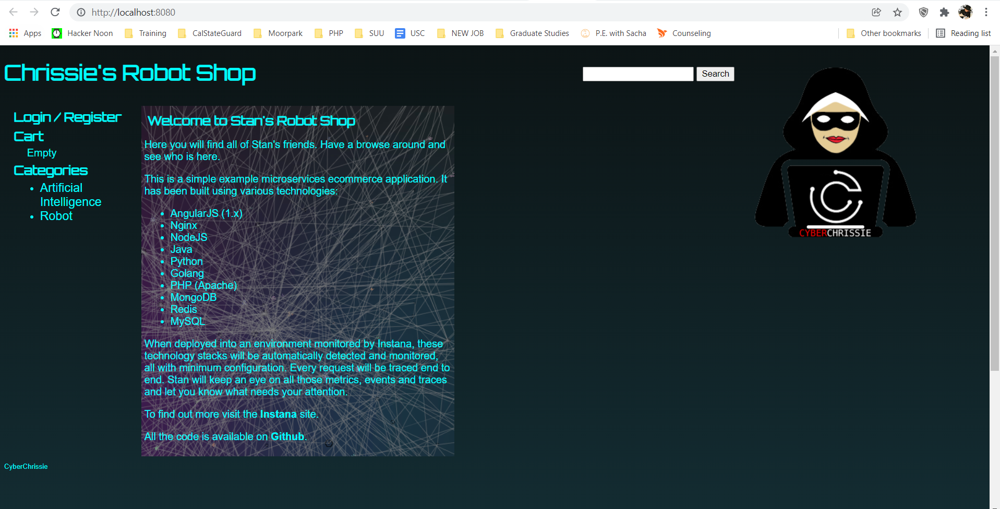

Create an output.md file capturing the steps you followed to run the
application and the screenshot of the homepage:

    1: installed docker desktop
    2: visted https://docs.microsoft.com/en-us/windows/wsl/install-manual#step-1---enable-the-windows-subsystem-for-linux
    3: enabled the windows subsystem for linux
    4: downloaded the linux kernal update package
    5: set wsl 2 as my default version
    6: installed ubuntu 20.04 via ms store
    7: performed sudo apt update
    8: git checkout master from branch chrissie
    9: ran docker-compose build
    10: ran docker-compose up
    11: verified running application robot-shop in docker
    12: visited http://localhost:8080/
    13: confirmed and took screenshot called homepage.png - placed into repo   

Is there anything wrong with committing the file directly to the master
branch?

    1: Master should reflect a production branch, a working final version. Working directly in master means that if you create bugs you have no other option for "going back" than to reverse/delete/reset commits, which is not a clean way of working and can cause you to lose the parts of the new code that were OK.

How would you prevent that? 

    1: Settings > Branches > Branch Protection Rules and click 'Add Rule'. Then, enter the name of the branch you want to protect and click the checkbox to require pull request reviews before merging.

If you made changes to the repository settings, then add it your answers in the output.md file
    
    1: none desired at this time

Find a fun, cool logo to replace the current one on the main page. Also put a signature at the bottom. 
    

Merge your changes into the main branch of your repo and add a screenshot of the new main page to output.md.

    1: Merged.
    2: Updating the docker instance with the new image and signature required some effort as the docker desktop open in editor DID not open the correct file.
    3. To work around:
        a: open cli in docker desktop
        b: find location of index.html 
        c: cd usr/share/nginx/html/
        d: apt install vim
        e: sed -i 's/Stan/Chrissie/g' index.html (changes reference of stan to chrissie)
        f: overwrite the images via https://docs.docker.com/engine/reference/commandline/cp/
        g: docker cp ../../cyberchrissie.png robot-shop_web_1:/usr/share/nginx/html/images/cyberchrissie.png

