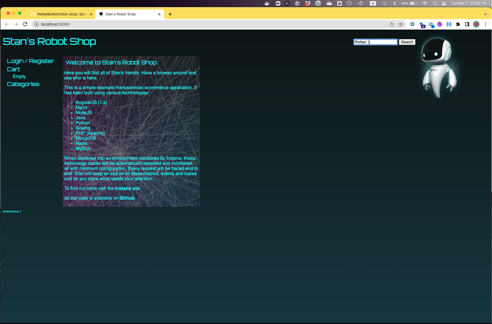
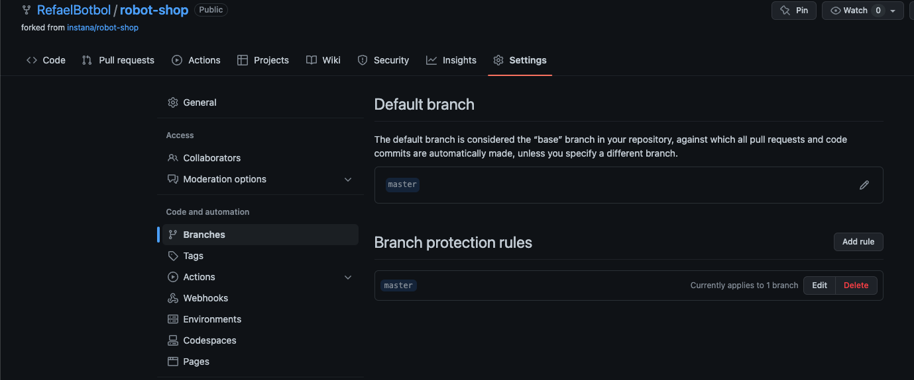
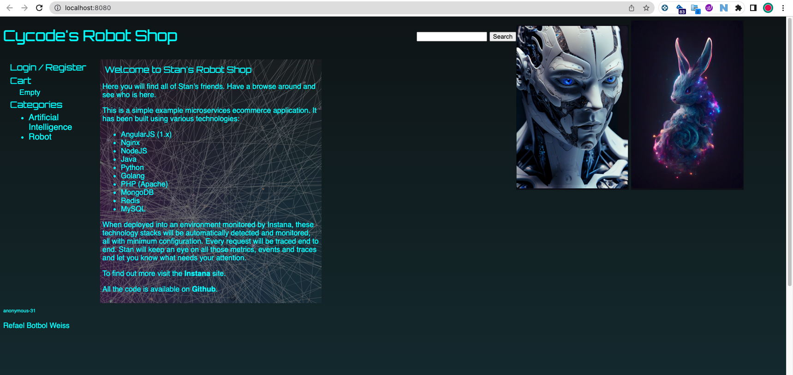

# Cycode technical assigenment - Refael
## Steps to run [Stan's shop](https://www.instana.com/blog/stans-robot-shop-sample-microservice-application/):
1. Clone Refael's fork from [here](https://github.com/RefaelBotbol/robot-shop) using ``` git clone https://github.com/RefaelBotbol/robot-shop.git```
2. Change to the project root directory 
3. Download newset images using ```docker-compose pull```
4. Lunch the app using ```docker-compose up ```
5. Open your browser and navigate to ``` http://localhost:8080/ ```

You should expect to see a similar homepage to this one:


## Why we should use the Pull request mechanisim instead of updating Master/Main directly

1. **Reflect production:** The Main (f.k.a Master) branch should reflect the code currently used in our production environment; by commiting to Main we break it and create an illusion of updated code which actually is not yet deployed

2. **Code timeline:** By branching out and using Pull Requests we can better track our changes and implement a healthy development methodology of peer-code-review. and keep our application source code clean and maintained - this is especially true when we have multiple dev teams and/or in a microservice architecture.

3. **Track specific feature work:** by using branches - developers can integrate partial working feature and benefit from the current integration (partial code > no code) and easily revert if needed without disturbing other teams cycles - this also means we can automate deployment and dev environments to test these branches before merging to master.
(no one wants to be that dev who pushed to master and overwrite their peers 5 hour work :rage: )

## How to prevent commit to master branch

1. First - I believe this starts with education of our engineers about the risks and why we shouldn't do it unless we absolutely have to.
2. Health code review process - implementing a pull request peer review before merging and automation connected to these pull requests for testing, depolying, and monitoring.
3. Github's **"Require pull request reviews before merging"** feature which can be enabled through ```Settings > Branches > Branch Protection Rules```
    - You can also enforce on moderators / admins to avoid accidents, they can remove it in case of an emergency.
    


## Editing the homepage
### Implement changes to web/index.html
1. Adding 2 files (cycode new rabbit and stans robot v2)
2. Add a simple signature 

### rebuild the images
1. In my docker settings I've disabled docker-compose v2 as the images are old and seem to use the old standard 
2. copy the images to the following location ``` ./web/static/media```
3. re-build the web docker using ```docker build ./web/ -t rs-web```
4. Update docker-compose.yaml to point the new local docker under ```Services->web->image```
5. Lunch the app with the new image 
6. Printscreen and update the repo with it 
7. Git commit, push, pull request, and approving it