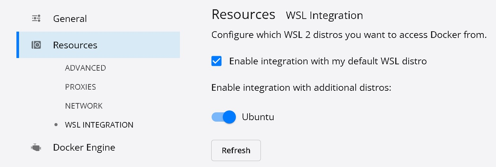
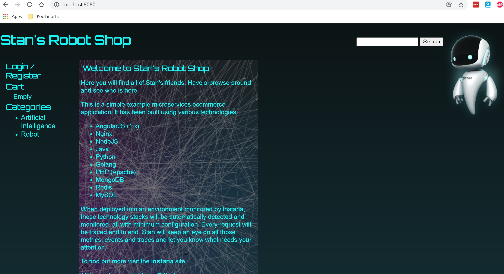
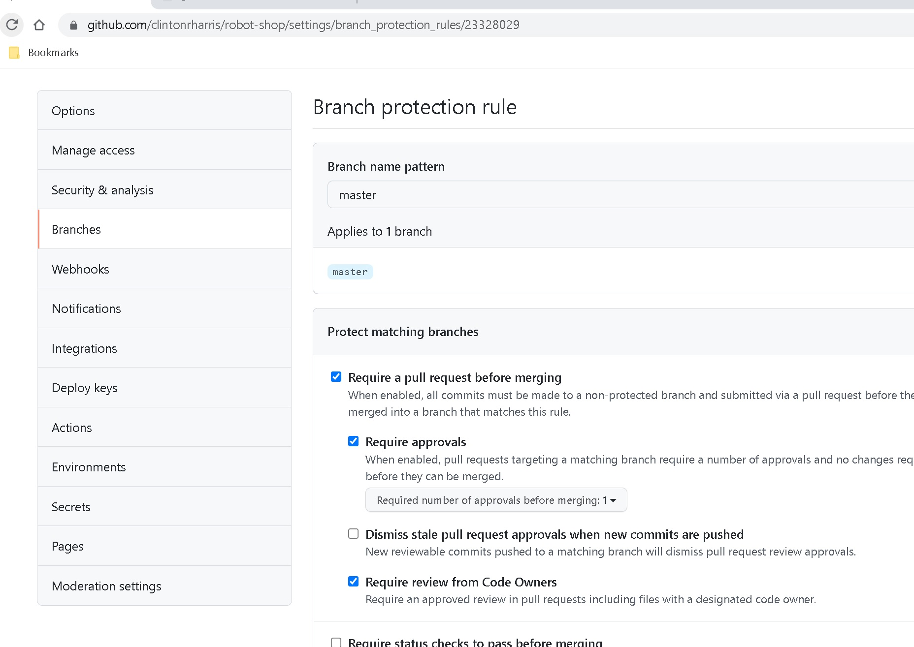
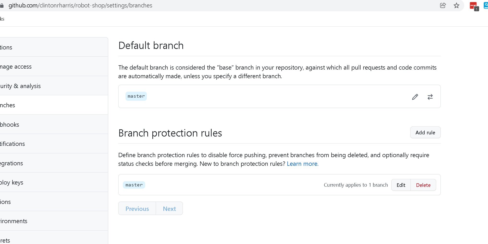
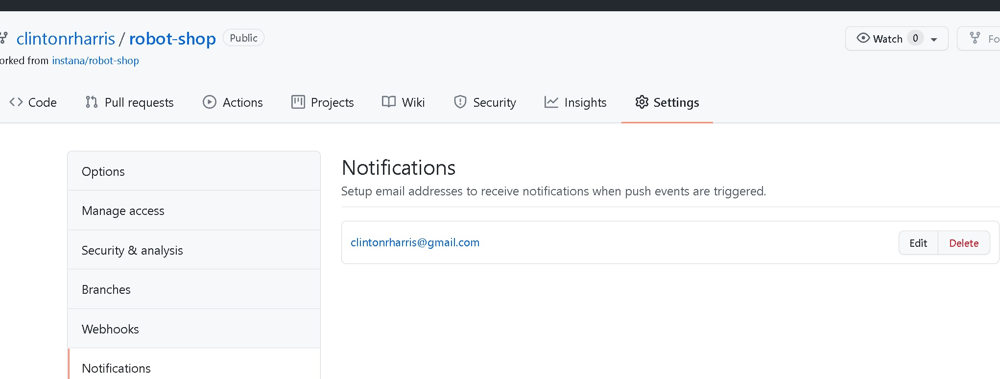
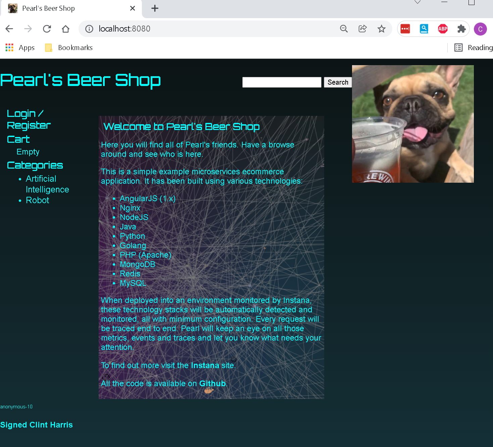

On my Windows platform, using administratove cmd prompt.

1. WSL already installed, enabled VM platform 
```shell
$ dism.exe /online /enable-feature /featurename:VirtualMachinePlatform /all /norestart
```

2. Upgraded existing Unbuntu WSL to 2
```shell
$ wsl --set-version Ubuntu 2
```

3. set WSL v2 default for good measure

```shell
$ wsl --set-default-version 2

```

4. Download and Install docker-desktop om windows per [instructions](https://docs.docker.com/desktop/windows/install/)


5. Enabled WSL Integration with Ubuntu



In my WSL Ubuntu environment (running in Windows)

5. From repo directory, set key and build images

```shell
export INSTANA_AGENT_KEY="<my key from instana)"

$ docker-compose build

```

6. Started application
```shell
$ docker-compose up

```

7. Accessed the store http://localhost:8080



7. Answers to 14: Some problems with working/committing directly to master include:
- If multiple developers are working on the same file at the same time, run the risk of a collision (committing different changes at same time ). 
-	Version control of new code can be difficult. 
-	Untested/validated code can be introduced (as opposed to branching, doing full testing of the introduced functionality, and then merging in the changes).
-	GA code could be changed so that other branched "patches" are not synced/kept up to date.

To prevent this, a "Branch Protection Rule" can be introduced. This will require and pushes be made vi a pull request, where it can be reviewed by admins/maintainers before being merged into the master (or any) branch.
To enable, navigate to settings > branches then add a rule for "master". 
Select require a pull request and set approvals. (require approvals, include admins)



Setup notifications



Updated main page. Pearl is my dog - so rebranded Stan's shop to be Pearl's

